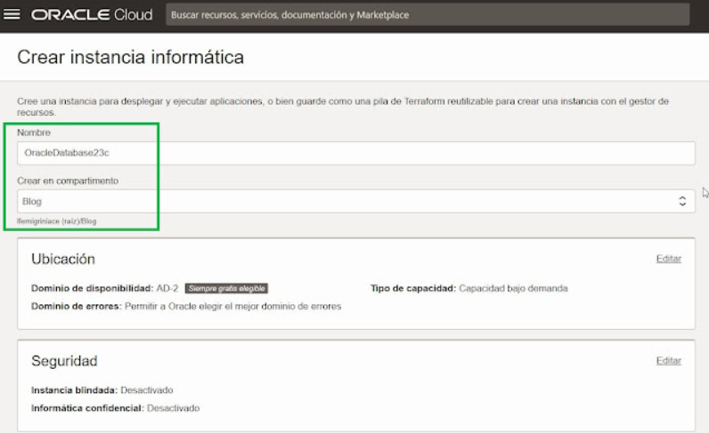
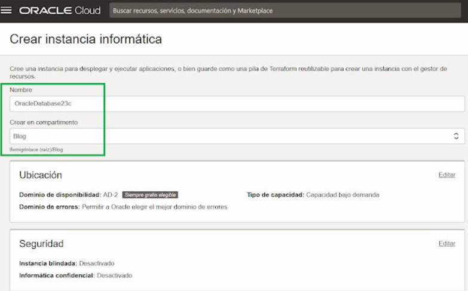
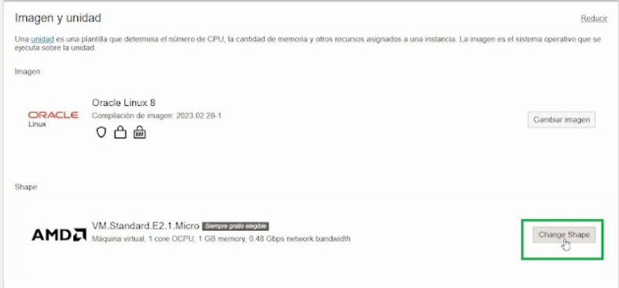
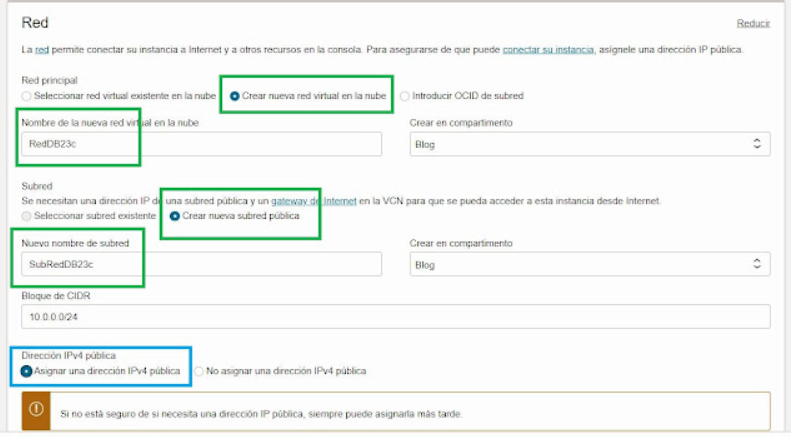

# 🌐 Tema Oracle Cloud
## 📙 Guía para Crear una Cuenta e Instancia en Oracle Cloud

###  💻 Registro en Oracle Cloud

1.- Accede a [Oracle Cloud](https://www.oracle.com/cloud/).

2.- Selecciona Empieza Gratis o elige la opción de registro para estudiantes.

3.- Completa el formulario con tu información personal.

4.- Confirma tu cuenta mediante el correo de verificación.

5.- Inicia sesión en el Panel de Oracle Cloud para administrar tus recursos.

### 💻 Creación de una Instancia en Oracle Cloud

1.- Accede a Oracle Cloud con el nombre de cliente en la nube proporcionado.

2.- Introduce los datos de inicio de sesión de tu cuenta.

### 💻 Iniciar la Creación de la Instancia

En el menú lateral, ve a Compute → Recursos informáticos.

1.- Selecciona Instancia.

2.- Presiona el botón Crear instancia.

### 💻 Configurar la Instancia

* Asignar un Nombre: Especifica un nombre, por ejemplo, mi-servidor.

  

* Seleccionar el Sistema Operativo: Elige una imagen, como Ubuntu 22.04.

  

* Definir la Configuración de la Máquina:

* Para la opción gratuita, selecciona "Ampere A1 Compute" o "VM.Standard.E2.1.Micro".

  

* Si necesitas más potencia, personaliza los recursos según tus necesidades.

Configurar la Red:

* Si no tienes una red, selecciona "Crear nueva red virtual en la nube".

* Activa la opción de IP pública si deseas acceso remoto.

### 💻 Configurar Claves SSH

En esta sección, puedes generar un par de claves SSH y descargar los archivos correspondientes:

* Finalizando la Configuración
  
* No es necesario modificar opciones avanzadas, así que simplemente presiona el botón Crear para iniciar la generación de la VM.

* El proceso de creación comenzará automáticamente y en menos de un minuto la instancia estará disponible.

* Si necesitas conectarte por SSH, usa el siguiente comando en PowerShell:

  ssh-keygen -t rsa -b 4096 -f ~/.ssh/oracle_key

