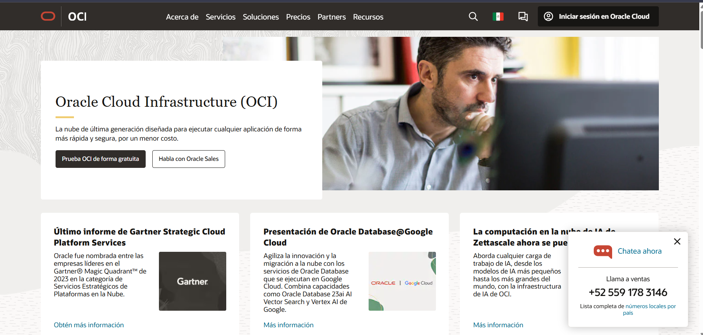

# 🌐 Tema Oracle Cloud
## 📙 Guía para Crear una Cuenta e Instancia en Oracle Cloud

###  💻 Registro en Oracle Cloud

1.- Accede a [Oracle Cloud](https://www.oracle.com/cloud/).

2.- Selecciona Empieza Gratis o elige la opción de registro para estudiantes.

3.- Completa el formulario con tu información personal.

4.- Confirma tu cuenta mediante el correo de verificación.

5.- Inicia sesión en el Panel de Oracle Cloud para administrar tus recursos.

